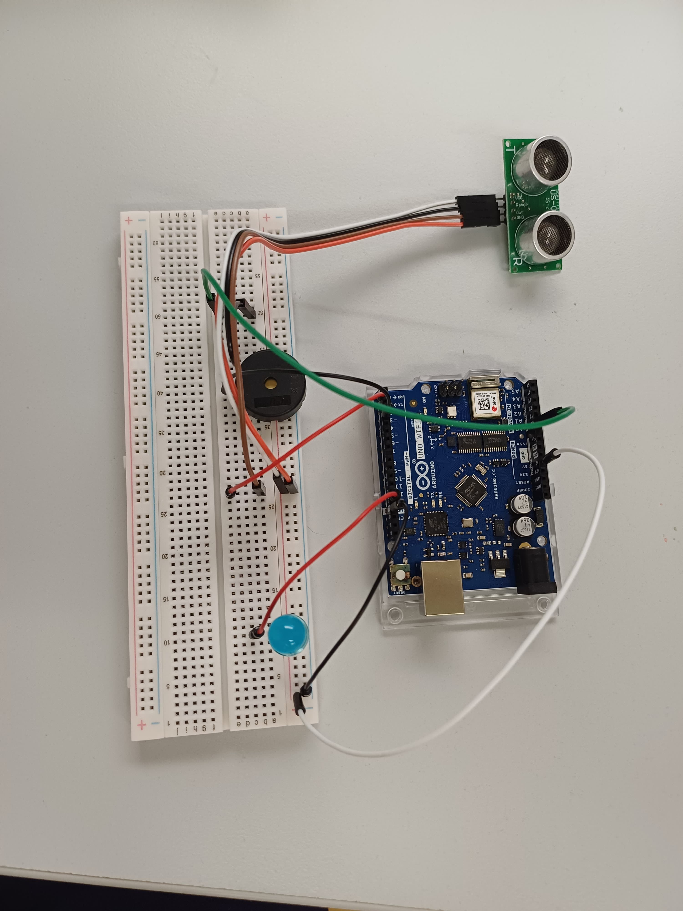
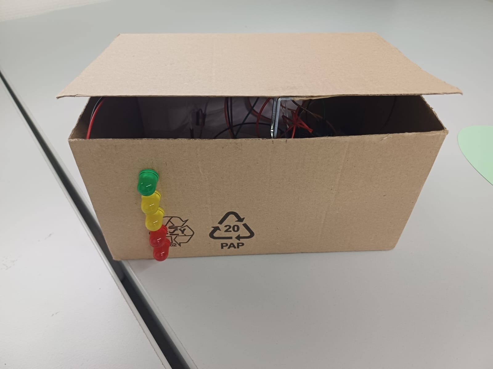
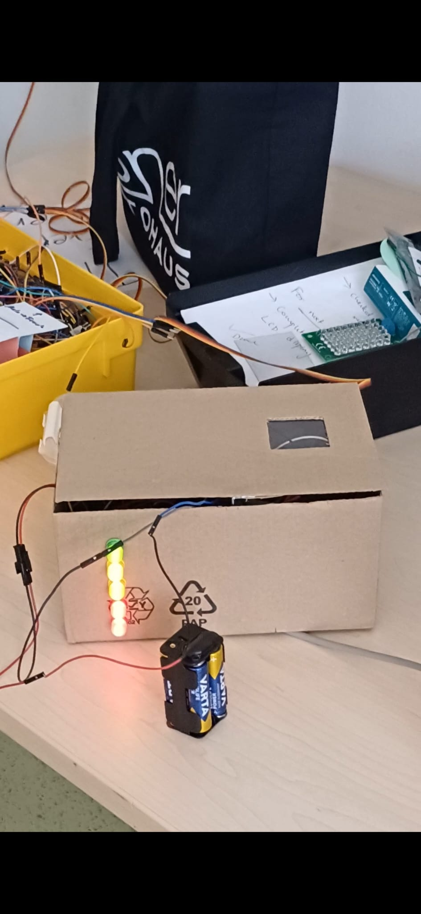

# Personal Cookie Jar

## Project Overview

The Personal Cookie Jar is an interactive physical computing prototype developed with Arduino. The project combines playful interaction design with behavior-based access control by requiring users to complete a short physical activity before accessing snacks.

The system encourages movement and routine-building through a simple action-to-reward mechanism: users must perform a series of jumps in order to unlock the cookie jar and eat cookies.

The prototype was developed as part of a Physical Computing course in a group of three.

---

## Concept

The main idea behind the project was to create a self-contained interactive object that promotes light physical activity before snacking.

The interaction loop was intentionally designed to be:
- simple
- understandable
- playful
- motivating

Users receive immediate visual and auditory feedback while completing the required exercise task.

---

## Features

- Ultrasonic sensor-based jump detection
- LED progress indicator system
- Buzzer feedback for successful jumps
- Electromagnetic lock mechanism
- Physical reward system
- Adjustable sensor positioning using magnetic mounting
- Transparent window to display cookie availability

---

## Interaction Flow

1. The user stands in front of the cookie jar
2. The ultrasonic sensor is mounted on the wall and detects jumping movements through proximity
3. Each successful jump:
   - increases LED progress
   - triggers audio feedback via buzzer
4. After 5 successful jumps:
   - the electromagnetic lock unlocks the jar
   - the user gains access to the cookies

---

## Technologies Used

- Arduino
- C/C++
- Ultrasonic Sensor
- LEDs
- Electromagnetic Lock
- Buzzer
- Physical Prototyping
- Interaction Design

---

## My Contributions

- Hardware assembly and prototyping
- Arduino programming and sensor integration
- Interaction logic implementation
- Feedback system design
- Testing and iteration of the interaction flow

---

## Screenshots

## Educational Goal

The goal of this project was to explore rapid prototyping in the context of physical computing by creating a functional interactive system using simple and available components.

The project focused on demonstrating how sensors, feedback systems, and physical interaction can be combined into an early-stage prototype without relying on complex or expensive hardware. Additionally, the prototype served as an exploration of tangible interaction design and behavior-based user experiences.
